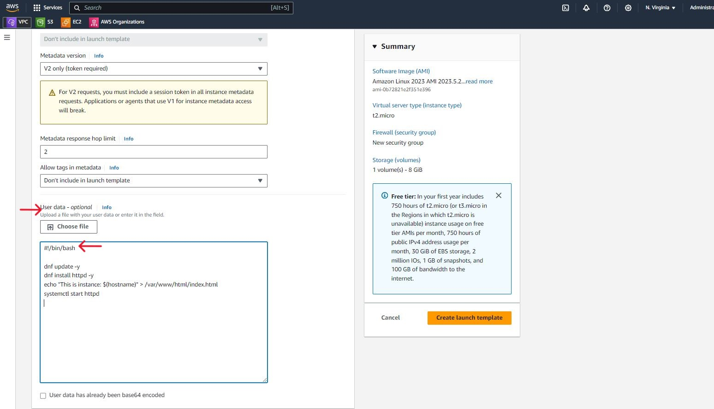
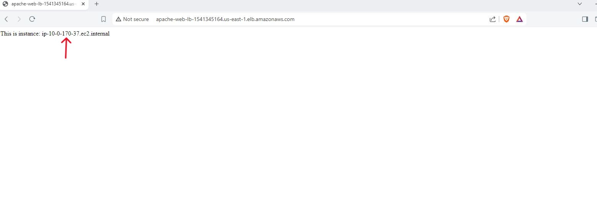
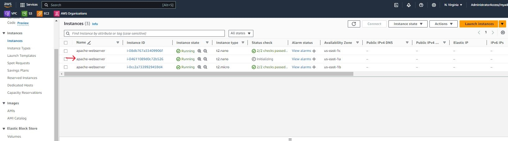

# Project: AWS Web Server Autoscaling Project
This project implements autoscaling for web servers deployed on EC2 instances in private subnets. It provides hands-on experience with creating a self-healing architecture and makes use of the following services;
 - Custom VPC
 - NAT Gateway 
 - EC2
 - Application Load Balancer
 - Security Groups
 - Launch Templates 
 - Autoscaling Groups 
 - Cloudwatch Alarms

The referene architecture can be seen below;

## Custom VPC
We start of the project by creating a custom VPC where we will deploy our resources. We navigate to the VPC dashboard in our AWS account.

From our VPC dashboard we click the Create VPC button.

Here we will configure our VPC settings and get a preview of what our VPC will look like. Under the VPC settings we select the VPC and more radio button as we want to configure our subnets as well as a NAT gateway. We can accept the auto-generated VPC name or provide a name of our choosing. We can maintain the IPv4 CIDR block value or update it with a value of our choosing.

For this project we want 3 availability zones for high availability of our instances. We also want to configure 3 public, 3 private subnets and a NAT Gateway. Our instances will run in our private subnet so that they are not accessible from the internet. Our NAT gateway will be deployed in a public subnet to give our instances access to the internet. We can deploy a NAT gateway in each availability zone but note that there is a charge for using NAT gateways and one will suffice for this project. We will not be making use of an S3 Gateway so we select None. Click Create VPC.

The VPC creation process will commence and take a few moments to complete.

Once the process is complete we can see from the resource map all the VPC components that have been created. In addition to our subnets and the NAT gateway, route tables have been created for our public and private subnets as well as an internet gateway which gives the resources in our public subnets access to the internet.

We can see our VPC under Your VPCs on the VPC dashboard.

We can view our subnets under the Subnets menu on our VPC dashboard.

We can view our route tables as well. The private route tables have a route that points to the NAT gateway. The subnet associations also shows that each private route table is explicitly associated with a private subnet.

There is one public route table that includes a route that points to the internet gateway. The subnet associations show that all our public subnets are explicitly associated with the public route table.

## Application Load Balancer & Target Group
Now that our VPC is set up, it is time to start deploying our resources. We will start off with our Application Load Balancer. From our EC2 dashboard, we navigate on Load Balancers at the lower end of the left-hand menu and click the Create load balancer button.

We click the create button for Application Load Balancer on the Compare and select load balancer type screen

Provide an appropriate name for the load balancer and keep the default scheme of Internet-facing as we want our load balancer to accept traffic from the internet. Leave the default IP address type of IPv4 unchanged.

Under the Network mapping configuration, select our new VPC and under Mappings select our new public subnets.

Under Security groups, we will be creating a new security group for our load balances. So we click on the link to take us to the security groups dashboard.

On the Security Groups dashboard click the Create security group button. Provide a name for the security group and a description. Select our VPC so that the security group is deployed into our VPC. Add an inbound rule to allow HTTP traffic from anywhere. Leave the default outbound rules and click the create security group button.

We navigate back to our application load balancer creation screen and click the refresh button to refresh the list of security groups. We can now select the security group we just created.

Under our Listeners and routing configuration, we will leave the protocol and port as HTTP:80. We have not created our target group yet so we click on the Create target group link. Our load balancer will forward traffic to the instances in our target group.

On the target group configuration screen leave the target type as Instances since our load balancer will be forwarding traffic to our EC2 instances. Provide a name for the target group.

Maintain the default protocol and port values of HTTP and 80 and ensure that our custom VPC is selected. Leave all other values as default and click the Next button.

We will not register any targets for now and we click on the Create target group button.

Now we return to the application load balancer creation screen and refresh our target group selection. We can now select our new target group. We will leave all other values as default and click the create load balancer button.

## Launch Template
Now we will set up our Launch Template. The launch template will be used with our Autoscaling group to deploy EC2 instances with our desired configuration in the event that any of our running instances goes down. Still on our EC2 dashboard, we navigate to Launch Templates in the left side Menu and click the Create launch template button.

We provide a name for our launch template and a version description if desired. Under Application & OS images we select the Quick Start tab and select Amazon Linux and the Amazon Linux 2023 AMI from the drop-down options.

 - Select the t2.micro instance type
 - choose Don't include in launch template under Key pair
 - Under Network settings choose Don't include in launch template for Subnet

 

 - Choose Create security group under Firewall
 - Provide a security group name and description
 - Select our custom VPC
 - Add an inbound security group rule to allow HTTP traffic on port 80 from the load balancer security group. This will allow HTTP traffic from only the application load balancer security group to our instances.

 

Leave all the other default configuration settings and move down to the Advanced details section. Scroll down to the User data section. Here we will add a bash script to install apache web servers on our instances. We can now click the Create launch template button.

 

 

## Autoscaling Group
It's time to create our Autoscaling group and verify that our architecture is working as required. We navigate to Autoscaling Groups on the EC2 dashboard and click Create Auto Scaling group.

Provide a name for the auto scaling group and select the launch template we created in the previous step. Under the version select Latest(1) as the value. This will enable our auto scaling group to select the latest version of our launch template if any changes are made to it. Click Next.

Select the custom VPC and availability zones/subnets you want your instances to be launched in. Here we select our private instances so as to prevent direct access to our web servers from the internet. Click Next

Next select the option to Attach an existing load balancer. We will select the target group we created earlier to link our autoscaling group to our load balancer. We will leave the default value for the VPC Lattice Integration options and under Health checks we will select the checkbox to Turn on Elastic Load Balancing health checks. Click Next.

Here we configure the desired, minimum desired and maximum desired capacity for our auto scaling group. We will not be configuring any scaling policies for now, so click Next.

We can skip notifications and click Next.

We can add tags here to identify the instances launched by the auto scaling group.

We review our configuration and click the Create Auto Scaling group button.

Our Auto Scaling group is created and starts to provision our web server instances in line with our configuration. So we should see 2 Ec2 instances being launched on our EC2 dashboard.

If we look at our target group, we will find that the two new instances are registered as targets in our target group. This shows that the application load balancer will be forwarding HTTP traffic to both of these web server instances.

We can confirm that our load balancer is forwarding HTTP traffic to our two instances by putting our load balancer DNS name into our browser and comparing the IP addresses from our browser to the IP addresses of our ec2 instances.

To check the self-healing capability of our architecture we can terminate one of our web server instances. The auto scaling group should deploy a new instance to replace the terminated instance once it has detected that there is an unhealthy instance.

## Modifying the Autoscaling Group & Launch Template
In the event that we want to change the number or instances we have running or we want to modify our launch configuration, we can achieve this by editing our autoscaling group settings or by modifying our launch template.

To edit the autoscaling group, from the Auto Scaling Groups pane on our EC2 dashboard, we select our autoscaling group and from the Actions drop down options select Edit.

We can for instance change our desired capacity from 2 to 1. The result of this will be that the autoscaling group will take one instance out of operation to match our updated configuration. After making desired changes we scroll down and click the update button.

If we take a look at the activity tab of our autoscaling group, we will see in a few moments that one of our instances is being terminated and that the connection draining is in progress. This will take a few minutes and on our EC2 dashboard we will see one of our web server instances begins to shutdown.

Once the shutdown process is complete we will be left with one running instance of our webserver.

If we want to modify our launch template, we move to the launch template dashboard and select our launch template. From the Actions drop down option select Modify template(Create new version).

We will modify our instance type from a t2.micro to a t2.nano and also modify our user data script to display a new message in our browser when we access our webserver through the load balancer. Once we are done we can click the Create template version button.

To see our changes take effect, we can go back and modify our autoscaling group configuration using the same steps we used previously. We will change our desired capacity from 1 to 2. 
This will cause our autoscaling group to launch a new instance to meet our new configuration. This new instance will be configured based on the new version of our launch template. This is because we selected Latest under version when we were creating our autoscaling group. This ensures that anytime our launch template is updated, our autoscaling group will always work with the latest version of our launch template.

Our autoscaling group starts to launch a new instance and we can go to our EC2 dashboard and confirm that the new instance has a t2.nano instance type. We can also put our load balancer DNS name in our browser to see our modified server message.

## Scaling Policies
In order to make our auto scaling groups more responsive to changes in demand, we can configure scaling policies which work with CloudWatch to track specific metrics. When specific thresholds are reached, Cloudwatch alarms are triggered and preset actions are taken. We will illustrate this using simple scaling policies.

From the Auto Scaling Groups dashboard, we select our Autoscaling group and move to the Automatic scaling tab. We click on the Create dynamic scaling policy button

Under Policy type we select Simple scaling and proivde a name for the policy. Under Cloudwatch alarm we click on the Create a CloudWatch alarm link.

We are taken to the CloudWatch dashboard and we click the Select metric button

We select EC2 from the list of metrics displayed.

We select By Auto Scaling Group next.

We want to use the CPUUtilization metric so we click the check box beside the CPUUtilization and click on the Select metric button.

Next we specify the conditions for the CloudWatch alarm. We want the CloudWatch alarm to be triggered when our instance CPUUtilization is greater than or equal to 70%. When the conditions are set we click on Next

We will not be configuring any actions here as we will do so within the Scaling policy dashboard so we click on the Remove button and click on Next.

We provide a name for the alarm and click on Next. We scroll down to the bottom of the review page and click Create alarm.

Once the alarm is created we go back to our Auto Scaling dashboard and continue creating our scaling policy. We click on the refresh button and select our newly created CloudWatch alarm from the drop down options. We add 1 capacity unit as the action to be taken once our CloudWatch alarm is triggered.

We can test our scaling policy by manually triggering the CloudWatch alarm. Once the alarm is triggered, our Autoscaling group should launch a new instance in accordance with our scaling policy configuration. To trigger the CloudWatch alarm we open our Cloudshell terminal by clicking the CloudShell icon on our page or using the search bar to navigate to CloudShell.

Once the terminal is open we run the following command to trigger our CloudWatch alarm.

aws cloudwatch set-alarm-state --alarm-name "Scale Out" --state-value ALARM --state-reason "Testing"

We can check our current alarm state in the CloudWatch dashboard. Once we run the command our alarm state will change to In alarm.

The Cloudwatch alarm is now In alarm and our auto scaling group has started to deploy a new instance.

We have now successfully implemented a self-healing cloud architecture where unhealthy instances are replaced by our autoscaling group and we can scale out or scale in our instances based on selected CloudWatch metrics. ☁😎😊

