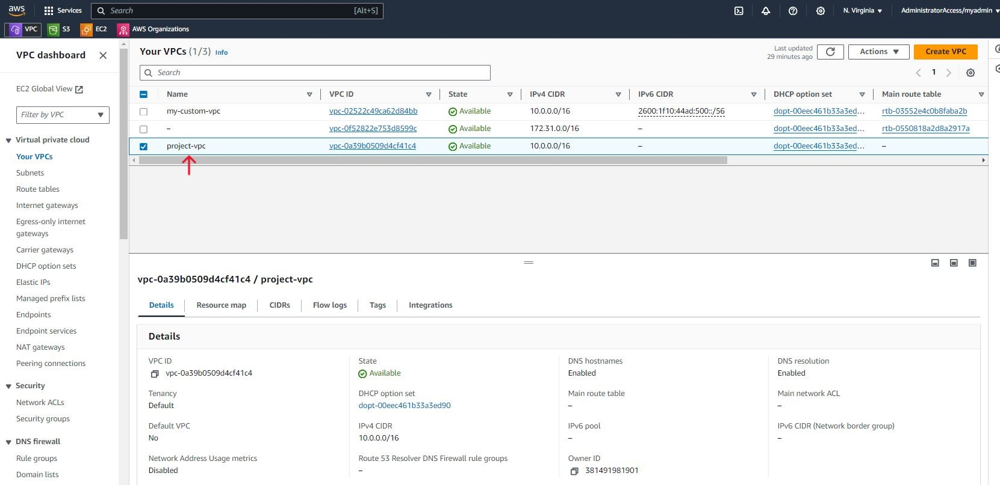

# Project: AWS Web Server Autoscaling Project
This project implements autoscaling for web servers deployed on EC2 instances in private subnets. It provides hands-on experience with creating a self-healing architecture and makes use of the following services;
 - Custom VPC
 - NAT Gateway 
 - EC2
 - Application Load Balancer
 - Security Groups
 - Launch Templates 
 - Autoscaling Groups 
 - Cloudwatch Alarms

The referene architecture can be seen below

## Custom VPC
We start of the project by creating a custom VPC where we will deploy our resources. We navigate to the VPC dashboard in our AWS account.

From our VPC dashboard we click the Create VPC button.

Here we will configure our VPC settings and get a preview of what our VPC will look like. Under the VPC settings we select the VPC and more radio button as we want to configure our subnets as well as a NAT gateway. We can accept the auto-generated VPC name or provide a name of our choosing. We can maintain the IPv4 CIDR block value or update it with a value of our choosing.

For this project we want 3 availability zones for high availability of our instances. We also want to configure 3 public, 3 private subnets and a NAT Gateway. Our instances will run in our private subnet so that they are not accessible from the internet. Our NAT gateway will be deployed in a public subnet to give our instances access to the internet. We can deploy a NAT gateway in each availability zone but note that there is a charge for using NAT gateways and one will suffice for this project. We will not be making use of an S3 Gateway so we select None. Click Create VPC.

The VPC creation process will commence and take a few moments to complete.

Once the process is complete we can see from the resource map all the VPC components that have been created. In addition to our subnets and the NAT gateway, route tables have been created for our public and private subnets as well as an internet gateway which gives the resources in our public subnets access to the internet.

We can see our VPC under Your VPCs on the VPC dashboard.

We can view our subnets under the Subnets menu on our VPC dashboard.

We can view our route tables as well. The private route tables have a route that points to the NAT gateway. The subnet associations also shows that each private route table is explicitly associated with a private subnet.

There is one public route table that includes a route that points to the internet gateway. The subnet associations show that all our public subnets are explicitly associated with the public route table.

