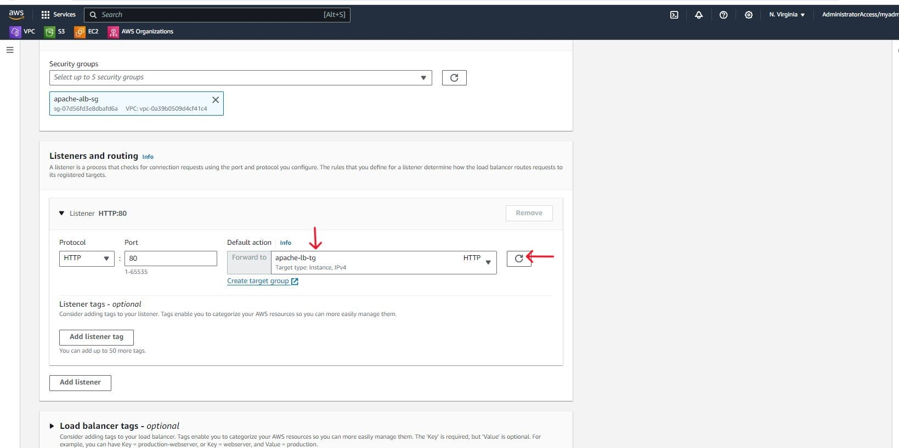

# Project: AWS Web Server Autoscaling Project
This project implements autoscaling for web servers deployed on EC2 instances in private subnets. It provides hands-on experience with creating a self-healing architecture and makes use of the following services;
 - Custom VPC
 - NAT Gateway 
 - EC2
 - Application Load Balancer
 - Security Groups
 - Launch Templates 
 - Autoscaling Groups 
 - Cloudwatch Alarms

The referene architecture can be seen below

## Custom VPC
We start of the project by creating a custom VPC where we will deploy our resources. We navigate to the VPC dashboard in our AWS account.

From our VPC dashboard we click the Create VPC button.

Here we will configure our VPC settings and get a preview of what our VPC will look like. Under the VPC settings we select the VPC and more radio button as we want to configure our subnets as well as a NAT gateway. We can accept the auto-generated VPC name or provide a name of our choosing. We can maintain the IPv4 CIDR block value or update it with a value of our choosing.

For this project we want 3 availability zones for high availability of our instances. We also want to configure 3 public, 3 private subnets and a NAT Gateway. Our instances will run in our private subnet so that they are not accessible from the internet. Our NAT gateway will be deployed in a public subnet to give our instances access to the internet. We can deploy a NAT gateway in each availability zone but note that there is a charge for using NAT gateways and one will suffice for this project. We will not be making use of an S3 Gateway so we select None. Click Create VPC.

The VPC creation process will commence and take a few moments to complete.

Once the process is complete we can see from the resource map all the VPC components that have been created. In addition to our subnets and the NAT gateway, route tables have been created for our public and private subnets as well as an internet gateway which gives the resources in our public subnets access to the internet.

We can see our VPC under Your VPCs on the VPC dashboard.

We can view our subnets under the Subnets menu on our VPC dashboard.

We can view our route tables as well. The private route tables have a route that points to the NAT gateway. The subnet associations also shows that each private route table is explicitly associated with a private subnet.

There is one public route table that includes a route that points to the internet gateway. The subnet associations show that all our public subnets are explicitly associated with the public route table.

## Application Load Balancer & Target Group
Now that our VPC is set up, it is time to start deploying our resources. We will start off with our Application Load Balancer. From our EC2 dashboard, we navigate on Load Balancers at the lower end of the left-hand menu and click the Create load balancer button.

We click the create button for Application Load Balancer on the Compare and select load balancer type screen

Provide an appropriate name for the load balancer and keep the default scheme of Internet-facing as we want our load balancer to accept traffic from the internet. Leave the default IP address type of IPv4 unchanged.

Under the Network mapping configuration, select our new VPC and under Mappings select our new public subnets.

Under Security groups, we will be creating a new security group for our load balances. So we click on the link to take us to the security groups dashboard.

On the Security Groups dashboard click the Create security group button. Provide a name for the security group and a description. Select our VPC so that the security group is deployed into our VPC. Add an inbound rule to allow HTTP traffic from anywhere. Leave the default outbound rules and click the create security group button.

We navigate back to our application load balancer creation screen and click the refresh button to refresh the list of security groups. We can now select the security group we just created.

Under our Listeners and routing configuration, we will leave the protocol and port as HTTP:80. We have not created our target group yet so we click on the Create target group link. Our load balancer will forward traffic to the instances in our target group.

On the target group configuration screen leave the target type as Instances since our load balancer will be forwarding traffic to our EC2 instances. Provide a name for the target group.

Maintain the default protocol and port values of HTTP and 80 and ensure that our custom VPC is selected. Leave all other values as default and click the Next button.

We will not register any targets for now and we click on the Create target group button.

Now we return to the application load balancer creation screen and refresh our target group selection. We can now select our new target group. We will leave all other values as default and click the create load balancer button.

## Launch Template
Now we will set up our Launch Template. The launch template will be used with our Autoscaling group to deploy EC2 instances with our desired configuration in the event that any of our running instances goes down. Still on our EC2 dashboard, we navigate to Launch Templates in the left side Menu and click the Create launch template button.

We provide a name for our launch template and a version description if desired. Under Application & OS images we select the Quick Start tab and select Amazon Linux and the Amazon Linux 2023 AMI from the drop-down options.

 - Select the t2.micro instance type
 - choose Don't include in launch template under Key pair
 - Under Network settings choose Don't include in launch template for Subnet

 

 - Choose Create security group under Firewall
 - Provide a security group name and description
 - Select our custom VPC
 - Add an inbound security group rule to allow HTTP traffic on port 80 from the load balancer security group. This will allow HTTP traffic from only the application load balancer security group to our instances.

 

 Leave all the other default configuration settings and move down to the Advanced details section. Scroll down to the User data section. Here we will add a bash script to install apache web servers on our instances. We can now click the Create launch template button.

 

 

