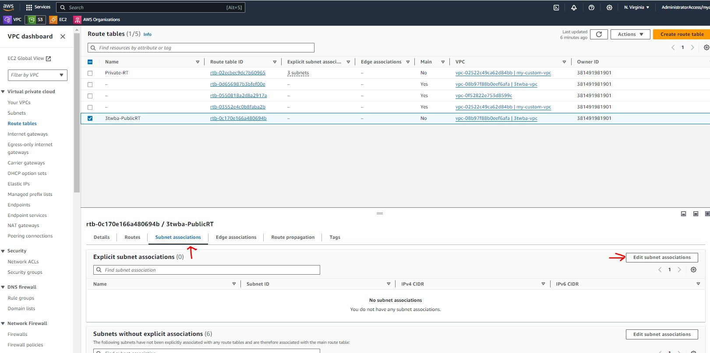
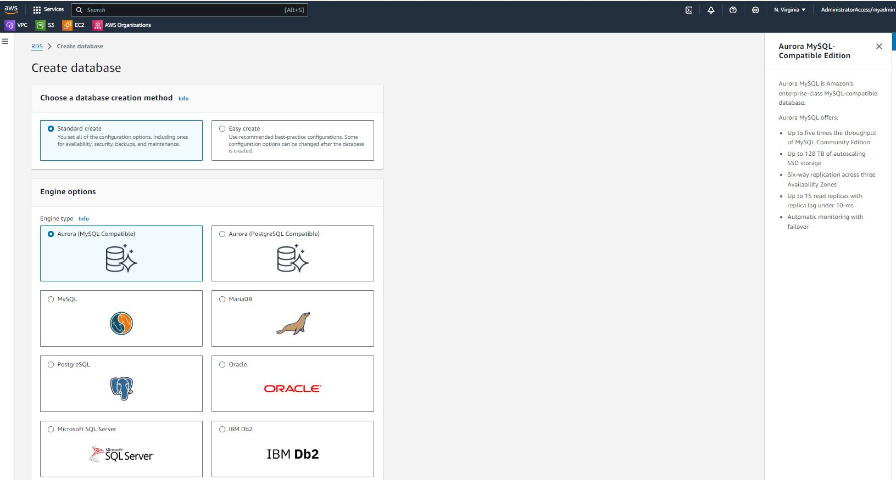
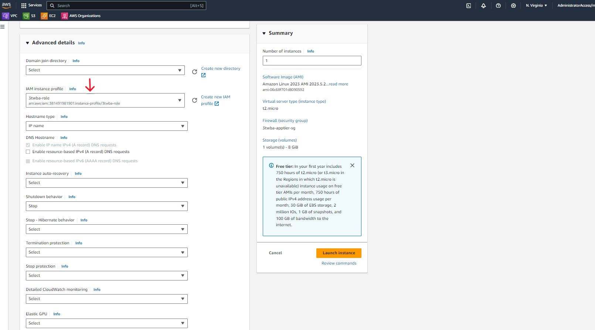
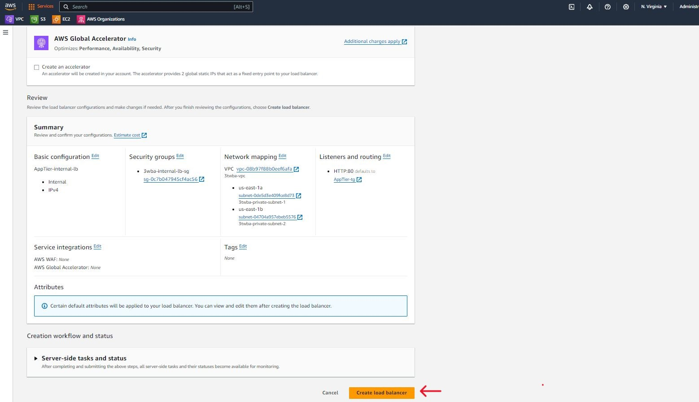
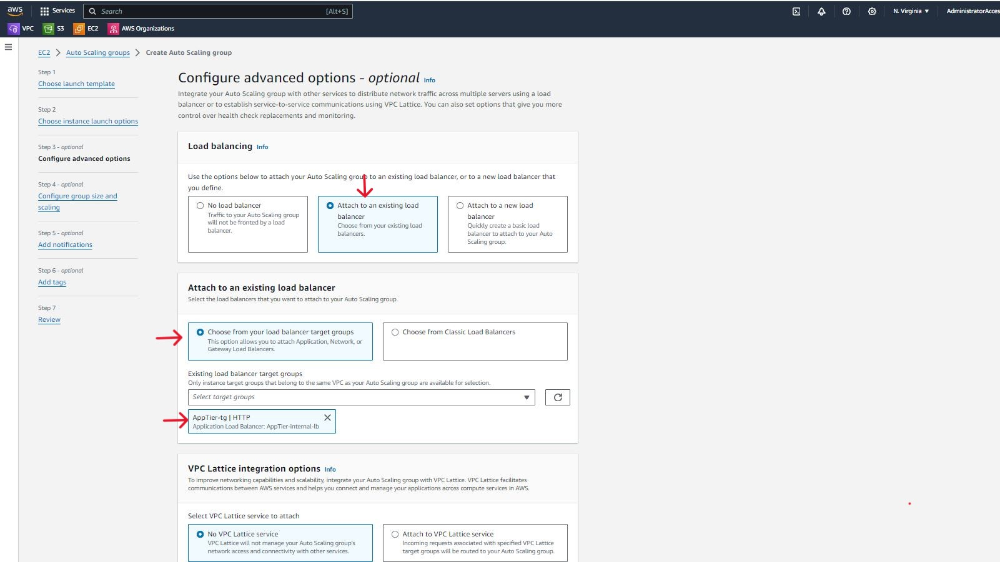

# Project: AWS Three Tier Web Architecture

This is a project from the AWS Workshop Studio - [find here](https://catalog.us-east-1.prod.workshops.aws/workshops/85cd2bb2-7f79-4e96-bdee-8078e469752a/en-US). The objective of the project is to deploy a three-tier web architecture consisting of external and internal load balancers, a web tier, an app tier and a database tier.

The project is split into seven parts and will give builders hands-on experience with VPCs, subnets, security groups, database deployment, load balancing and autoscaling.

The reference architecture can be seen below. I recreated this using the Lucidchart App - [lucidchart](https://www.lucidchart.com/pages/?);

The architecture is laid out as follows;

- An internet-facing load balancer which forwards traffic to our web tier, consisting of Nginx servers deployed on ec2 instances in two public subnets.
- The Nginx servers serve a React.js website and directs API calls to the app tier's internal load balancer. The internal load balancer then forwards the traffic to the application tier.
- The application tier manipulates data in an Amazon Aurora MySQL database and returns it to our web tier.
- VPC, Subnets, Autoscaling, Security groups, Launch Template and Target groups are all configured as part of a successful deployment of this architecture.

## Initial Setup

The application code for this project has been provided and will be downloaded from Github. The next step is to create an s3 bucket where we will upload our code later on.

I provide my bucket with a unique name and leave the default entries unchanged.

The next piece of the initial set up is creating an EC2 Instance role in IAM. The purpose of this role is to give our instances permissions to download our code from S3 and to also use Systems Manager Session Manager to securely connect to our instances without using SSH keys.

I navigate to the IAM dashboard and create an EC2 role under the Roles menu option.

The AmazonSSMManagedInstanceCore and AmazonS3ReadOnlyAccess permissions policies will be added to the EC2 role to provide the required permissions.

## Networking & Security

In this section of the project we will create a custom VPC and configure our subnets, route tables, internet gateway, NAT gateway and security groups.

I navigate to the VPC dashboard and create VPC.

I provide a name tag for the VPC and choose a CIDR range. I click the create VPC button to create my VPC. Choose a CIDR range that allows you to create at least 6 subnets.

Next, I move on to create the subnets. For this project we will need 6 subnets across two availability zones. Each availability zone will consist of a 1 public subnet and 2 private subnets as shown in the architecture diagram.
I navigate to subnets in my VPC dashboard and use the create subnet button.

It is important here to use a naming convention that will allow you to easily identify your subnets and all the other resources that we will be configuring. This will save you some head-scratching as you progress with the project (I learnt the hard way 😖)

So now I have 3 subnets each across two availability zones.

Now we move on to configure internet access for ur public subnets by creating an internet gateway and attaching it to our VPC. I move to Internet gateways on my VPC Dashboard and click on the Create internet gateway button.

I provide a suitable name for my internet gateway and create it.

The next step is to attach the internet gateway to our VPC. This can be done immediately after the internet gateway is created using the Attach to VPC button or from the Actions drop down selection.

I select my VPC from the dialog box and complete the attachment.

Now we move on to configure internet access for our private subnets, to allow our app tier to access the internet. To make our architecture highly available, we will deploy one NAT gateway in each public subnet. To get this done I navigate to NAT gateways on my VPC dashboard.

I click on the create NAT gateway button and provide a suitable name for the NAT gateway. I select one of the public subnets created earlier and use the Allocate Elastic IP button to allocate a public IP address to the NAT gateway.

I repeat this process for the other public subnet. I now have two NAT gateways provisioned.

Public IP addresses are billed by AWS so keep this in mind to avoid any surprise costs. You can estimate the cost of your public IPs using the aws pricing calculator [here](https://calculator.aws/#/createCalculator/VPC)

Now we move on to configure our route tables to direct the traffice within our subnets. We will start with a route table for our public subnet

From the VPC dashboard I select Route tables from the left hand menu and use the Create route table button

I provide an appropriate name for the route table and select our custom VPC.

Now we need to update the routes in our route table. I select the new route table and move to the routes tab. Then I click the Edit routes button.

Here we will add a route to direct traffic from the VPC to the internet gateway.

Now we will associate the route table with the two public subnets in our VPC. I move to the subnet associations tab and Edit subnet associations.

Here I select the two public subnets in our custom VPC and save associations.

We will repeat this process to create a route table for each private subnet in our app tier. These will direct traffic from our app tier to the NAT gateways we created earlier.

It's time to create our security groups. I will stress again here that your naming convention will be very important so that you don't get confused later on in the projects. Name your security groups as explicitly as possible. From the VPC dashboard I navigate to Security Groups on the left side menu and click on the Create security group button. Security groups will help us control traffic to the resources in our subnets.

Our first security group is for our internet-facing load balancer. I name the security group appropriately and select our custom VPC. I will add an inbound rule to allow HTTP traffic from my IP address.

The second security group is for our the instances we will launch in our web tier. We want traffic to the web servers on these instances to come from our internet-facing load balancer. To do this we will add a rule that allows HTTP traffic and select the source as the internet-facing load balancer security group we just created in the previous step. I will also allow HTTP access from my IP so that I can access the instance when we test our setup.

The third security group will be for our internal load balancer. This will allow traffic from our web tier instances to get to our internal load balancer via our web tier security group.

The fourth security group will be for our private instances. Our app tier will reside here and we want to allow traffic from our internal load balancer to our app tier. The inbound rule will allow TCP traffic on port 4000 via the internal load balancer security group. We will add another rule to allow traffic TCP traffic on port 4000 from my IP.

The fifth and final security group will be for our database tier. This will allow traffic from our private instances to our MySQL/Aurora database. The inbound rule will allow traffic on port 3306 from the private instance security group.

## Database Deployment

Next we move on to deploy the database layer for our architecture. To do this I navigate to the RDS dashboard in our AWS account. Once on the RDS dashboard, navigate to Subnet groups on the left-side menu and use the Create DB subnet group button.

Here we provide a name and description for our subnet group and select our custom VPC. Then we select availability zones and the subnets we created for our database layer. We can confirm that we are selecting the right subnets by navigating to our VPC dashboard and viewing the subnet IDs. Once the right selections have been made we click the create button

Now we navigate to Databases on our RDS dashboard and click the create database button.

There are several configuration steps to complete here. We choose the Standard create method and select the Aurora(MySQL Compatible) Engine option.

Under the Templates section we select Dev/Test since this is not a production database. Here we will need to provide a username and password which we will note down as we will be using them to access our database later on.

Under the Instance configuration section, the memory optimized classes are selected by default. These are large instance so for the purpose of this project I selected the burstable classes option and left the default db.t3.medium instance.

Under the availability and durability section we choose the option to create an Aurora Replica. We leave the defaults in the connectivity section and select our custom VPC and the security group we created previously for our database tier.

Under the additional configuration, provide a database name, leave all other defaults configurations as is and create the database.

Once the databse is provisioned, there will be a reader instance and a writer instance in the database subnets of each availability zone. We will note the writer endpoint down for later use.

## App Tier Deployment

Here I am creating and configuring the EC2 instance for the app layer of our architecture. A Node.js application will run on port 4000 on our app layer. We will also add some data and tables to our database.

We navigate to instances on the EC2 dashboard and Launch instances.

The instance will be configured as follows;

- name the instance appropriately
- use the default Amazon Linux 2023 AMi
- use the default t2.micro instance type
- under Key pair login select the Proceed without keypair option
- under Network setting click on the edit button
  - Select the custom VPC, one of the private subnets we created for the app layer and the IAM role we created.
  - Auto assign public IP should have Disable as value.
  - use the Select existing security group option and select the app tier security group we created earlier.
- leave the default storage values.
- under advanced details
  - select the instance role we created earlier.

Leave all other options as default and launch the instance.

Back on the EC2 dashboard, we can see the new instance. It will take a few minutes to get into a running state and pass status checks. Our next step is to connect to the instance. To do this select the checkmark box beside the instance and click on the Connect button, or right-click on the instance name and select connect from the options that appear.

Select the Session Manager tab and click Connect

A terminal will open up in a seperate window and we will be logged in as ssm-user. We switch to ec2-user by using the sudo -su ec2-user command.

We can confirm that the instance in our private subnet is able to reach the internet via the NAT gateways by pinging any common DNS server domain name/IP address such as google.com/8.8.8.8. We should get a successful transmission of packets if our network has been configured correctly.

Now we move on to configure the database. We start by downloading the MySQL CLI. The workshop instructions provided here gave me an error, I believe they were using a previous version of the Amazon Linux AMI.

I used a google search to find the amazon documentation for the installation [here](https://docs.aws.amazon.com/AmazonRDS/latest/UserGuide/CHAP_GettingStarted.CreatingConnecting.MySQL.html#CHAP_GettingStarted.Connecting.MySQL). You can install the MySQL CLI client from MariaDB.

From here it's time to initiate our DB connection with our Aurora RDS writer endpoint. The following command is provided - mysql -h CHANGE-TO-YOUR-RDS-ENDPOINT -u CHANGE-TO-USER-NAME -p. Enter your password when prompted.

Next step we create a database called webappdb using the command as shown.

Verify that the database was created using the SHOW DATABASES command.

Now we will navigate to the database we just created and create a table where we will insert some data, using the following commands.

- USE webappdb;
- CREATE TABLE IF NOT EXISTS transactions(id INT NOT NULL
  AUTO_INCREMENT, amount DECIMAL(10,2), description
  VARCHAR(100), PRIMARY KEY(id));

We can verify that the table was created using the SHOW TABLES; command.

Next we want to insert data into our table with the following command - INSERT INTO transactions (amount,description) VALUES ('400','groceries');

We can verify the data was added to our table by using the following command - SELECT \* FROM transactions;

We can exit the database now using the exit command.

### Configure App Instance

For this section of our project, I will first update the database credentials for the app tier. This file is part of the code downloaded from the github repo for this project.

This is not best practice but will suffice for this project.

Now I upload the app-tier folder to the S3 bucket I created during the initial set-up for this project.

The next step is to install all the components needed to run our backend application. From our Session Manager session, we will perform the following steps;

- install NVM (node version manager)

- install a compatible version of Node.js and confirm it is in use

- install PM2, a daemon process manager that will keep the node.js app running when we exit the instance or reboot it.

Now we will download our code from the S3 bucket onto our instance.

After the download is complete, I navigate to the app-tier directory, install the dependencies and start the app

A status of online confirms that the app is running.

We need to make sure our app restarts and keeps running in the event the server is interrupted for any reason. To accomplish this we will run the pm2 startup command.

Copy and paste the command in the output that is displayed on the terminal.

After running this command, save the current list of node processes with the following command - pm2 save

### Test App Tier

Now we will run a few tests to check that our app is properly configured and can retrieve data from the database. Our first command will test our health check endpoint, which will tell us if the app is running. We will use the following command - curl http://localhost:4000/health

This will return a response "This is the health check" as seen above.

Next we can test the database connection by hitting the following endpoint locally using this command - curl http://localhost:4000/transaction

This will return the data we added to our database earlier. These responses show that our app layer is fully configured.

## Internal Load Balancing & Autoscaling

Our first step here is to create an AMI (Amazon Machine Image) of our
app tier instance. This is basically an image of our instance that we can use to lauch new instances that will have exactly the same configuration as our running instance. To get this done, on my EC2 dashboard I select the app tier instanceand under the Actions drop-down options I select Image and templates and Create Image.

Provide an appropriate name for the image and click Create image.

We can find the new image by navigating to AMIs under Images in the left-side menu of our EC2 dashboard.

### Target Group

Next we want to create our target group which we will use in conjunction with our load balancer. The target group is group of resources ( in this case our app tier instances) that the load balancer directs incoming traffic to. Navigate to the left hand menu on our EC2 dashboard again and towards the bottom select Target Groups and use the Create target group button.

For the basic configuration maintain the default target type of Instances. Give the target group an appropriate name and leave the default Protocol:Port option of HTTP:80. Select the custom VPC and update the health check path to /health. Click the Next button

We will not register any targets yet so I click on the Create target group button.

### Internal Load Balancer

To create our load balancer we navigate again to the left had side of our EC2 dashboard and select Load Balancers. Click on the Create load balancer button.

Here we select the create button for the Application Load Balancer as that is the type we will be using.

For the Basic configuration, provide a load balancer name and select the Internal option under Scheme. Under Network mapping select our custom VPC

Select the availability zones and private subnets for the app tier. Select the security group we created for the internal load balancer. The load balancer will be listening for HTTP traffic on port 80. Select the target group we just created, this is where the load balancer will forward traffic to.

Leave the other options as default and create the load balancer

### Launch Template

Next we need to create a Launch Template that we will use with our Autoscaling group. On our EC2 dashboard we select Launch Template from the left side menu.

The launch template will have the following configurations;

- Provide an appropriate name for the launch template.

- Under the Application and OS Images, select the My AMIs tab and the app tier image we created earlier. Select the t2.micro instance type.

- leave the key pair default as we will not be needing a key pair to access our instances. Select the app tier security group.

- under Advanced details select the IAM instance role we used with our EC2 instance. Leave all other values as default and create the launch template

### Auto Scaling

Now it's time to create our Auto Scaling group. On the EC2 dashboard navigate to Auto Scaling Groups under Auto Scaling on the left hand menu and click Create Auto Scaling group.

Provide an appropriate name for your Auto Scaling group and select the launch template we just created and click Next.

Under the instance launch options, select the custom VPC and availability zones with our private subnets and click on Next.

Here we attach the Auto Scaling group to our load balancer by selecting the load balancer's target group from the drop-down options. We leave all the other default settings and click on Next.

Next we configure the Group size by setting our Desired capacity, Min desired capacity and Max desired capacity. We will not be setting up any scaling policies so we click Next.

Click the Skip to review button and create Auto Scaling group. If we have configured our load balancer and auto scaling group properly, the auto scaling group should start to launch 2 new instances in our app tier.

We can confirm this on our EC2 dashboard. Our original app tier instance is still running hence we will see 3 instances running in our instance dashboard.

