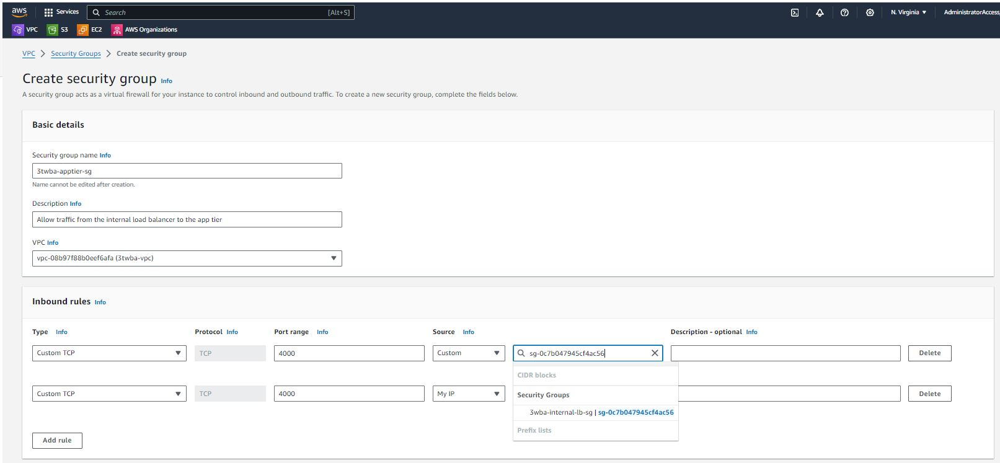
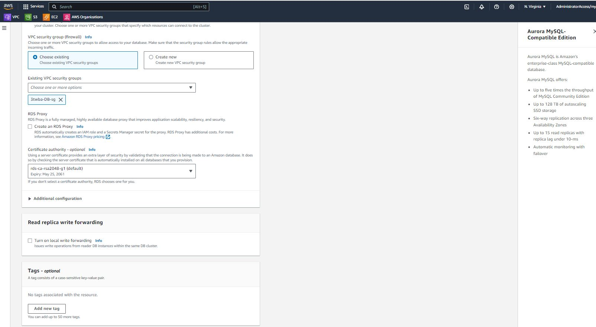
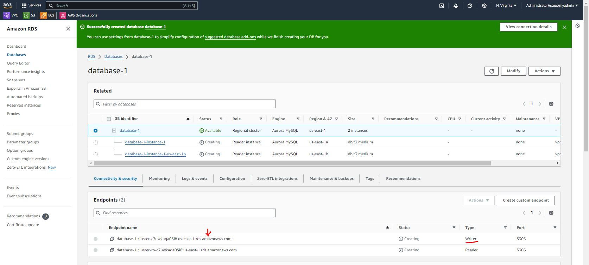

# Project: AWS Three Tier Web Architecture

This is a project from the AWS Workshop Studio - [find here](https://catalog.us-east-1.prod.workshops.aws/workshops/85cd2bb2-7f79-4e96-bdee-8078e469752a/en-US). The objective of the project is to deploy a three-tier web architecture consisting of external and internal load balancers, a web tier, an app tier and a database tier.

The project is split into seven parts and will give builders hands-on experience with VPCs, subnets, security groups, database deployment, load balancing and autoscaling.

The reference architecture can be seen below. I recreated this using the Lucidchart App - [lucidchart](https://www.lucidchart.com/pages/?);

The architecture is laid out as follows;

- An internet-facing load balancer which forwards traffic to our web tier, consisting of Nginx servers deployed on ec2 instances in two public subnets.
- The Nginx servers serve a React.js website and directs API calls to the app tier's internal load balancer. The internal load balancer then forwards the traffic to the application tier.
- The application tier manipulates data in an Amazon Aurora MySQL database and returns it to our web tier.
- VPC, Subnets, Autoscaling, Security groups, Launch Template and Target groups are all configured as part of a successful deployment of this architecture.

## Initial Setup

The application code for this project has been provided and will be downloaded from Github. The next step is to create an s3 bucket where we will upload our code later on.

I provide my bucket with a unique name and leave the default entries unchanged.

The next piece of the initial set up is creating an EC2 Instance role in IAM. The purpose of this role is to give our instances permissions to download our code from S3 and to also use Systems Manager Session Manager to securely connect to our instances without using SSH keys.

I navigate to the IAM dashboard and create an EC2 role under the Roles menu option.

The AmazonSSMManagedInstanceCore and AmazonS3ReadOnlyAccess permissions policies will be added to the EC2 role to provide the required permissions.

## Networking & Security

In this section of the project we will create a custom VPC and configure our subnets, route tables, internet gateway, NAT gateway and security groups.

I navigate to the VPC dashboard and create VPC.

I provide a name tag for the VPC and choose a CIDR range. I click the create VPC button to create my VPC. Choose a CIDR range that allows you to create at least 6 subnets.

Next, I move on to create the subnets. For this project we will need 6 subnets across two availability zones. Each availability zone will consist of a 1 public subnet and 2 private subnets as shown in the architecture diagram.
I navigate to subnets in my VPC dashboard and use the create subnet button.

It is important here to use a naming convention that will allow you to easily identify your subnets and all the other resources that we will be configuring. This will save you some head-scratching as you progress with the project (I learnt the hard way 😖)

So now I have 3 subnets each across two availability zones.

Now we move on to configure internet access for ur public subnets by creating an internet gateway and attaching it to our VPC. I move to Internet gateways on my VPC Dashboard and click on the Create internet gateway button.

I provide a suitable name for my internet gateway and create it.

The next step is to attach the internet gateway to our VPC. This can be done immediately after the internet gateway is created using the Attach to VPC button or from the Actions drop down selection.

I select my VPC from the dialog box and complete the attachment.

Now we move on to configure internet access for our private subnets, to allow our app tier to access the internet. To make our architecture highly available, we will deploy one NAT gateway in each public subnet. To get this done I navigate to NAT gateways on my VPC dashboard.

I click on the create NAT gateway button and provide a suitable name for the NAT gateway. I select one of the public subnets created earlier and use the Allocate Elastic IP button to allocate a public IP address to the NAT gateway.

I repeat this process for the other public subnet. I now have two NAT gateways provisioned.

Public IP addresses are billed by AWS so keep this in mind to avoid any surprise costs. You can estimate the cost of your public IPs using the aws pricing calculator [here](https://calculator.aws/#/createCalculator/VPC)

Now we move on to configure our route tables to direct the traffice within our subnets. We will start with a route table for our public subnet

From the VPC dashboard I select Route tables from the left hand menu and use the Create route table button

I provide an appropriate name for the route table and select our custom VPC.

Now we need to update the routes in our route table. I select the new route table and move to the routes tab. Then I click the Edit routes button.

Here we will add a route to direct traffic from the VPC to the internet gateway.

Now we will associate the route table with the two public subnets in our VPC. I move to the subnet associations tab and Edit subnet associations.

Here I select the two public subnets in our custom VPC and save associations.

We will repeat this process to create a route table for each private subnet in our app tier. These will direct traffic from our app tier to the NAT gateways we created earlier.

It's time to create our security groups. I will stress again here that your naming convention will be very important so that you don't get confused later on in the projects. Name your security groups as explicitly as possible. From the VPC dashboard I navigate to Security Groups on the left side menu and click on the Create security group button. Security groups will help us control traffic to the resources in our subnets.

Our first security group is for our internet-facing load balancer. I name the security group appropriately and select our custom VPC. I will add an inbound rule to allow HTTP traffic from my IP address. 

The second security group is for our the instances we will launch in our web tier. We want traffic to the web servers on these instances to come from our internet-facing load balancer. To do this we will add a rule that allows HTTP traffic and select the source as the internet-facing load balancer security group we just created in the previous step. I will also allow HTTP access from my IP so that I can access the instance when we test our setup.

The third security group will be for our internal load balancer. This will allow traffic from our web tier instances to get to our internal load balancer via our web tier security group. 

The fourth security group will be for our private instances. Our app tier will reside here and we want to allow traffic from our internal load balancer to our app tier. The inbound rule will allow TCP traffic on port 4000 via the internal load balancer security group. We will add another rule to allow traffic TCP traffic on port 4000 from my IP.

The fifth and final security group will be for our database tier. This will allow traffic from our private instances to our MySQL/Aurora database. The inbound rule will allow traffic on port 3306 from the private instance security group.

## Database Deployment
Next we move on to deploy the database layer for our architecture. To do this I navigate to the RDS dashboard in our AWS account. Once on the RDS dashboard, navigate to Subnet groups on the left-side menu and use the Create DB subnet group button.

Here we provide a name and description for our subnet group and select our custom VPC. Then we select availability zones and the subnets we created for our database layer. We can confirm that we are selecting the right subnets by navigating to our VPC dashboard and viewing the subnet IDs. Once the right selections have been made we click the create button

Now we navigate to Databases on our RDS dashboard and click the create database button.

There are several configuration steps to complete here. We choose the Standard create method and select the Aurora(MySQL Compatible) Engine option.

Under the Templates section we select Dev/Test since this is not a production database. Here we will need to provide a username and password which we will note down as we will be using them to access our database later on.

Under the Instance configuration section, the memory optimized classes are selected by default. These are large instance so for the purpose of this project I selected the burstable classes option and left  the default db.t3.medium instance.

Under the availability and durability section we choose the option to create an Aurora Replica. We leave the defaults in the connectivity section and select our custom VPC and the security group we created previously for our database tier.

Under the additional configuration, provide a database name, leave all other defaults configurations as is and create the database.

Once the databse is provisioned, there will be a reader instance and a writer instance in the database subnets of each availability zone. We will note the writer endpoint down for later use.

